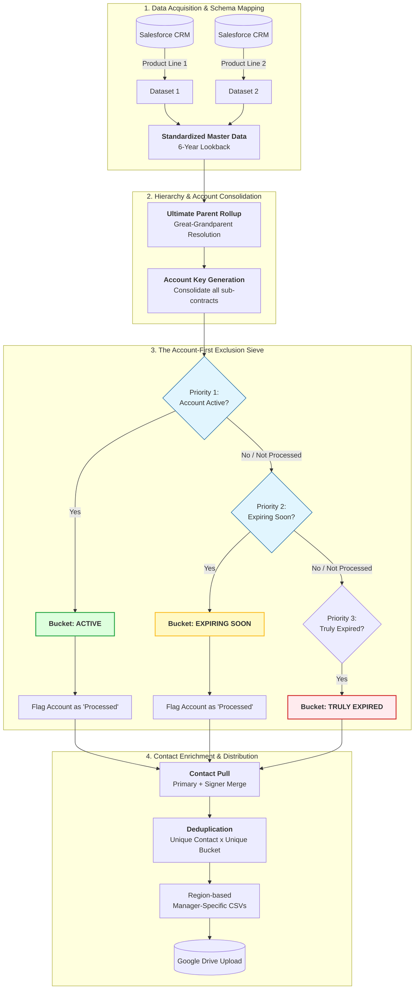
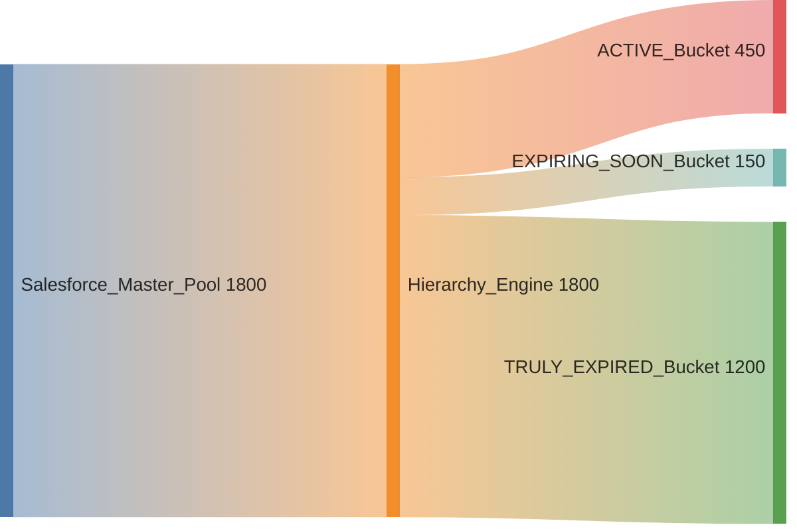

# Enterprise Contract Reconciliation & Hierarchical Account Mapping

This project provides an automated ETL pipeline for extracting, normalizing, and categorizing enterprise contract data across a **6-year historical lookback**. By resolving complex Salesforce account hierarchies and applying a priority-based "Exclusion Sieve," the system generates high-integrity marketing lists for regional distribution.

---

## 🏗️ System Architecture & Logic Flow
The following diagrams illustrate the automated logic, data flow, and structural models used in this pipeline.

### 1. Functional Process Flow
This chart illustrates the end-to-end technical journey from raw Salesforce extraction to automated regional delivery.

### 2. Data Volume Flow (Sankey)
Visualizing how the master pool resolves into non-overlapping stakeholder pools.

### 3. Class Hierarchy & Data Model (PlantUML)
Detailed mapping of the relationship traversal from child contracts to the Ultimate Parent level.

---

## 🚀 The Core Challenge: Hierarchy Fragmentation
In large-scale CRM environments, contracts often exist at various subsidiary levels. A "Child Account" may appear expired, while the "Ultimate Parent" remains active. 
* **The Risk:** Sending re-acquisition offers to active corporate clients ("False Churn").
* **The Solution:** A recursive hierarchy rollup that identifies the relationship status at the highest corporate level before bucket assignment.

## 🛠️ Key Technical Achievements

### 1. Recursive Hierarchy Resolution
To ensure data integrity, the pipeline traverses four levels of the Salesforce account object hierarchy (`Account.Parent.Parent.Parent.Name`). This allows the script to consolidate all transactional history under a single **Ultimate Parent** ID, ensuring the categorization reflects the total business relationship rather than a single siloed contract.

### 2. The "Account-First" Exclusion Engine
Unlike simple row-filtering, this logic treats the **Account** as the primary unit of measure.
* If an account holds *any* active contract, the account key is locked into the **Active** bucket.
* This "processed" flag prevents the account from appearing in lower-priority pools (Expiring or Expired), protecting the brand's professional image.

### 3. Automated Stakeholder Enrichment
The engine dynamically extracts and merges contacts from multiple roles:
* **Primary Contacts:** Operational stakeholders and follow-up leads.
* **Contract Signers:** Key decision-makers and financial signatories.
* **Deduplication:** A custom merging strategy ensures that unique individuals are contacted only once.

## 💻 Tech Stack
* **Python:** Core data processing and exclusion logic.
* **Pandas:** High-performance data manipulation and cross-object merging.
* **Simple-Salesforce:** SOQL query execution and CRM API integration.
* **Google Drive API:** Automated delivery and regional file categorization.

---

## 📈 Impact
By moving from manual list-pulling to an automated Python pipeline, the project reduced data preparation time by ~90% and eliminated the risk of brand-damaging "false churn" communications to top-tier enterprise clients.
